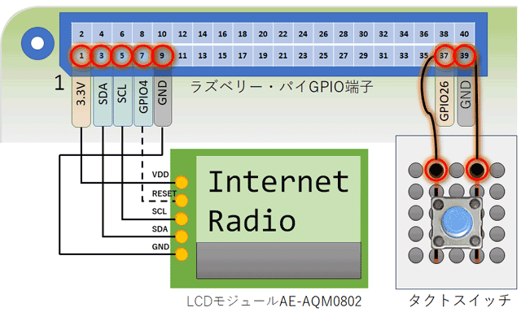

# audio/radio/pi

## ご注意
-------------------------------------------------------------------------------
実行する前に、お住いの国の著作権法などに十分に注意してください。  
Please pay close attention to the copyright laws of your country.  
-------------------------------------------------------------------------------
日本語(Japanese): 
- 筆者が公開しているプログラムは技術的な学習や検証を目的として作成したものです。
- また、ソース内のURLについてもサンプルです。
- 掲載したURLの各サイトが配信するコンテンツの著作権については、配信サイトに
  確認ください。
- もし日本国または米国の法律に違反していることを当方が認知した場合は、速やかに
  GitHub内に保存した該当URLを削除します。当方はそれ以上の責任を負いません。

English: 

- The following was translated using Google translation service. If there is a
  discrepancy in the content below, the original text written in Japanese will
  take precedence.

- The program published by the author was created for the purpose of technical
  learning and verification.
- Also, the URL in the source is also a sample.
- Check with the distribution site for the copyright of the content distributed
  by each site of the posted URL, please.
- If I become aware that there is a violation of Japanese or US law, I will 
  promptly delete the relevant URL stored in GitHub.
  I do not take any further responsibility.

## Schematics for Raspberry Pi 5

  

